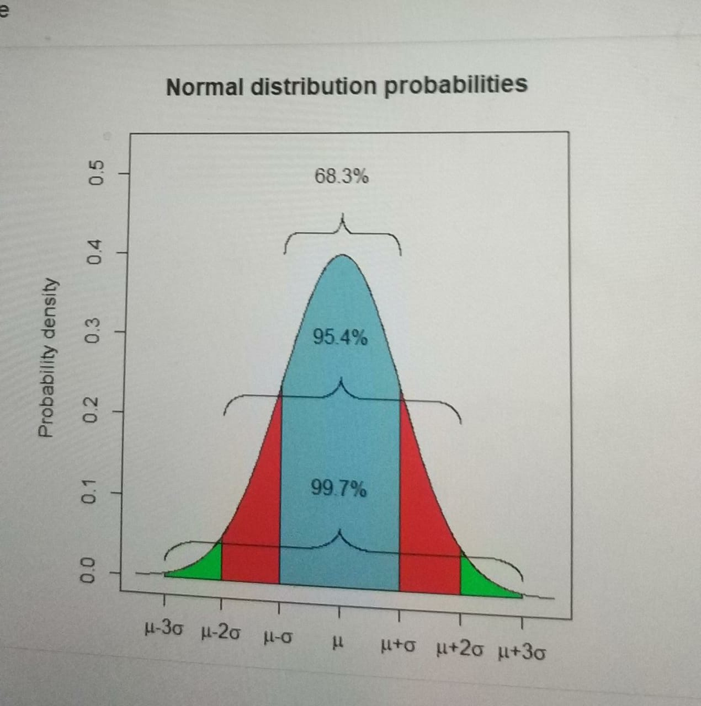

#### Integrantes do Grupo:

* Bruno Marcelino 
* Miguel Manassés

### Bibliotecas Importadas

```{r, message = FALSE, warning = FALSE}
library("tidyverse")
library("lubridate")
library("tidyquant")
library("egcm")
library("Quandl")
library("ggthemes")
```

<br />

### Considerações Iniciais

Este documento tem como finalidade expor a aplicação prática (de forma simplificada) de um modelo de arbitragem estatística por meio de pairs trading para ativos do setor financeiro. A seleção dos pares de ativos a serem utilizados consiste em avaliar a cointegração entre seus respectivos preços no período de *treino*, utilizando de dois métodos de avaliação. Caso haja sinal positivo simultâneo para a cointegração, será aplicada uma relação - previamente definida - de "Long & Short" (baseada em dados empíricos coletados em artigos e outros) com os ativos no período de *teste*. 

<br />

### Período de Treino 

Para a fase de treinamento do modelo, temos como objetivo realizar dois dos testes de cointegração mais conhecidos atualmente: o teste de Engle-Granger e o teste de Dickey-Fuller aumentado. Admitimos que a hipótese alternativa de cointegração possuiria significância estatística caso fosse aceita nos ambos testes (P-Valor < 0.05). 

Foi escolhido um período de treino que refletisse um momento em que o mercado havia se dissociado da situação de estresse ocasionada pela crise do coronavírus. Chegamos à essa conclusão a partir de análise têcnica feita com o ETF indicativo do desempenho do mercado: BOVA11.

##### Teste de Engle-Granger 

A função utilizada está dentro do pacote `egcm`. Dado um vetor com um conjunto de tickers de ativos e o período a ser utilizado na análise das cotações, a função realiza o teste para diversos pares possíveis de ativos, e armazena os dados obtidos em uma tabela. A partir daí podemos filtrar os ativos que testaram positivo para cointegração e optamos por selecionar o par que apresentou menor p-valor (BEES4 e BPAC11).

```{r, message = FALSE, warning = FALSE, results = 'hide'}
inicio_treino <- as.Date("2020-08-10")
fim_treino <- as.Date("2020-12-31")
tickers <- c("BRIV4.SA", "ABCB4.SA","BEES4.SA","BMGB4.SA","RPAD3.SA","BIDI4.SA","ITUB4.SA","BBDC4.SA","BBDC3.SA","BBAS3.SA","BPAC11.SA","ITSA4.SA","ITUB4.SA","SANB11.SA")

teste_eg <- allpairs.egcm(tickers, startdate = inicio_treino, enddate = fim_treino, clear.na.inf = TRUE)
```

```{r}
cointegrados <- teste_eg %>% tibble() %>% filter(is.cointegrated == TRUE)
cointegrados <- cointegrados[-c(4),]

ativo_x <- as.character(cointegrados[3,1])
ativo_y <- as.character(cointegrados[3,2])
```

##### Teste de Dickey-Fuller Aumentado

Para realizar o teste de Dickey-Fuller aumentado, precisamos realizar uma regressão linear entre as cotações de preço dos ativos a serem analisados. A partir daí, verificaremos se o vetor de resíduos apresenta ou não o comportamento característico de uma série temporal estacionária (não apresenta tendência definida, ou seja, tende a ser um valor específico, na média). Isso permite a realização de L&S com a esperança de que a distância entre os preços dos ativos sempre reverta à média quando fugir do padrão estabelecido em amostra.

```{r, message = FALSE, warning = FALSE}
df_x <- ativo_x %>% 
    tq_get(get = "stock.prices", from = inicio_treino, to = fim_treino) %>% 
    mutate(adjusted = na.locf(adjusted))

df_y <- ativo_y %>% 
    tq_get(get = "stock.prices", from = inicio_treino, to = fim_treino) %>% 
    mutate(adjusted = na.locf(adjusted))

reg_treino <- lm(df_y$adjusted ~ df_x$adjusted)
residuos_treino <- residuals(reg_treino)

tseries::adf.test(residuos_treino)
```

##### Gráfico da Distribuição dos Resíduos

```{r, message = FALSE, warning = FALSE}
n_amostras <- seq(from = 1, to = length(df_y$adjusted), by = 1)
ativos <- tibble("Ativo Y" = df_y$adjusted, "Ativo X" = df_x$adjusted, "Residuos" = residuos_treino, "Amostras" = n_amostras)

# Para que os ativos sejam cointegrados, a série de resíduos da regressão deve ser estacionária (inclinação constante)

ativos %>% ggplot(aes(y = Residuos, x = Amostras, color = "white")) +
    geom_point(aes(color = "drv")) + 
    theme_light() + 
    geom_smooth(method = "lm",  color = "red")
```

##### Série Histórica dos Ativos - Período de Treino

```{r, echo = FALSE, message = FALSE, warning = FALSE}
# Gráfico das Cotações
cotacoes_treino <- df_x  %>%
    bind_rows(df_y)  %>%
    group_by(symbol) %>%
    select(date, adjusted)

cotacoes_treino %>% ggplot(aes(x = date, y = adjusted, col = symbol)) +
    geom_line(size = 1) +
    labs(title = "", x = "", y = "Preço Ajustado", color = "", subtitle = "Cotações Diárias Importadas do Yahoo Finance") +
    facet_wrap(~ symbol, ncol = 2, scales = "free") +
    scale_y_continuous(labels = scales::dollar) +
    theme_tq() + 
    scale_color_tq()
```

<br />

### Período de Teste 

O período pelo qual a estratégia entrará em vigor será logo após a data de teste, e estabelecemos como sendo o primeiro trimestre de 2021.

```{r}
inicio_teste <- as.Date("2021-01-01")
fim_teste <- as.Date("2021-03-31")

cotacoes_teste <- c(ativo_x, ativo_y) %>% 
    tq_get(get = "stock.prices", from = inicio_teste, to = fim_teste) %>% 
    mutate(adjusted = na.locf(adjusted)) %>% 
    select(symbol, date, adjusted) 

df_cotacoes <- cotacoes_teste %>% 
    group_by(symbol) %>% 
    spread(key = symbol, value = adjusted)
```

##### Série Histórica dos Ativos - Período de Teste

```{r, echo = FALSE}
# Gráfico das Cotações
cotacoes_teste %>%
    ggplot(aes(x = date, y = adjusted, color = symbol)) +
    geom_line(size = 1) +
    labs(title = "", x = "", y = "Preço Ajustado", color = "", subtitle = "Cotações Diárias Importadas do Yahoo Finance") +
    facet_wrap(~ symbol, ncol = 2, scales = "free") +
    scale_y_continuous(labels = scales::dollar) +
    theme_tq() + 
    scale_color_tq()
```

Utilizando os coeficientes obtidos na regressão feita no período de treino, calculamos à mão o vetor de resíduos para cada dia em que a estratégia estará em vigor, para que não haja viés. A partir daí, calcularemos o Z-valor observado para cada dia como sendo a distância (em desvios-padrão) entre o dado e a média dos resíduos obtida no período de treino. Caso os resíduos observados apresentem Z-valor muito acima do nosso intervalo de confiança estabelecido para ativos cointegrados (95%, ou seja, $|Z{obs}| >= 2$) entraremos em operação visando a reversão à média do comportamento dos preços. 

$$
 Z{obs} = (\epsilon - \mu)/ \sigma
$$




```{r}
# Alfa e Beta (será utilizado o anterior no momento de aplicação da estratégia)
beta <- summary(reg_treino)$coefficients[2]
alfa <- summary(reg_treino)$coefficients[1]

# Calcularemos os resíduos com base nos coeficientes da regressão de treino
y_previsto <- alfa + (beta * df_cotacoes$BEES4.SA) 
residuos_teste <- df_cotacoes$BPAC11.SA - y_previsto
```

```{r}
# Vetor com o Z-score para cada dia
z_score <- (residuos_teste - mean(residuos_treino)) / sd(residuos_treino)

# Criando df com os retornos
retornos <- cotacoes_teste %>% 
    group_by(symbol) %>% 
    tq_transmute(select = adjusted,
                 mutate_fun = dailyReturn,
                 type = "log",
                 col_rename = "retornos") %>% 
    spread(key = symbol, value = retornos)

### --- Sinais --- ###
# long x, short y : 1
# short x, long y : -1
# neutro : 0

resultado <- retornos %>% 
    mutate("z_score_teste" = z_score) %>% 
    mutate("Sinal" = ifelse(z_score_teste >= 2, -1, ifelse(z_score_teste <= -2, 1, 0))) %>%  
    mutate("retorno" = ifelse(Sinal == 1, BEES4.SA + (beta * -BPAC11.SA), ifelse(Sinal == -1, -BEES4.SA + (beta * BPAC11.SA), 0)))
```

##### Inclusão da Taxa SELIC e Custos de Transação

Acrescentaremos alguns fatores externos relacionados ao ambiente de negócios ao qual o modelo está inserido, para tornar a análise de retornos acumulados mais realista. 

* Partimos do pressuposto de que em todos os momentos nos quais o modelo não estiver comprado ou vendido em nenhum ativo, o montante de capital de risco será aplicado em um título de renda fixa livre de risco, que possuirá rendimento equivalente ao da taxa SELIC vigente no período.

```{r}
Quandl.api_key('TC1ow5j6G7s4SFHTzgDz') # Comando necessário pra acessar o Quandl

selic_diaria <-  as.data.frame(Quandl("BCB/11", type = "xts")/100) # Importando a série do selic direto da API Bacen

df_selic <- selic_diaria %>% 
    rownames_to_column() %>% 
    tibble() %>% 
    rename("date" = rowname, "selic" = V1) %>% 
    mutate(selic = na.locf(selic))

df_selic$date <- as.Date(df_selic$date)
``` 

* Os custos de transação foram fixados como de 0,5% e devidamente subtraídos dos retornos obtidos toda vez em que houver uma transação.

```{r}
custos <- 0.005

resultado <- resultado %>% 
    left_join(df_selic, by = "date") %>% 
    mutate(retorno = ifelse(Sinal == 0, df_selic$selic, retorno)) %>% 
    mutate(custos = ifelse(lag(Sinal) != Sinal, custos, 0)) %>% 
    mutate(retorno = retorno - custos)
    
resultado$retorno[1] <- 0    
```

<br />

### Análise de Desempenho e Resultados Obtidos

```{r}
desempenho <- resultado %>% 
    select(date, retorno) %>% 
    mutate("retorno_acumulado" = cumprod(1 + retorno)-1) %>% 
    left_join(df_selic, by = "date") %>% 
    mutate("MM" = SMA(retorno_acumulado, 7)) %>% 
    mutate("cor" = as.factor(ifelse(retorno_acumulado >= 0, "Positivo", "Negativo")))

# Retorno acumulado por ativo
desempenho %>% 
    ggplot(aes(date, retorno_acumulado)) + 
    geom_point(aes(col = cor), size = 3) + 
    geom_hline(yintercept = 0, linetype = "dashed") +
    geom_hline(yintercept = 1, linetype = "dashed") +
    labs(title = "Retorno Acumulado", x = "Data", y = "", color = "") +
    scale_y_continuous(labels = scales::percent) +
    scale_color_discrete(name = "Desempenho") +
    theme_economist_white() 

#Drawdown por ativo
desempenho %>% 
    mutate(DD = DrawdownPeak(retorno)) %>% 
    ggplot(aes(x = date, y = DD)) +
    geom_line() +
    labs(title = "Drawdown", x = "Data", y = "", color = "") +
    theme_tq() +
    scale_y_continuous(labels = scales::percent) +
    theme_economist_white() 

# Histograma com a frequência de obtenção de cada retorno diário
desempenho %>% ggplot() + 
    geom_histogram(aes(retorno), binwidth = 0.05, fill = "3", col = "black") +
    labs(title = "Retorno Diário", x = "", y = "") +
    scale_x_continuous(labels = scales::percent) +
    theme_economist_white() 
```

##### Algumas Estatísticas Descritivas...

```{r}
n_transacoes <- resultado %>% summarize("n" = sum(ifelse(resultado$custos[-1] != 0, 1, 0))/2) %>% .$n
retorno_acumulado <- desempenho$retorno_acumulado[length(desempenho$retorno_acumulado)]

estatisticas <- rbind(n_transacoes, retorno_acumulado)
colnames(estatisticas) <- "Estatisticas"
rownames(estatisticas) <- c("Número de Transacoes", "Retorno Acumulado Total")

estatisticas
```
